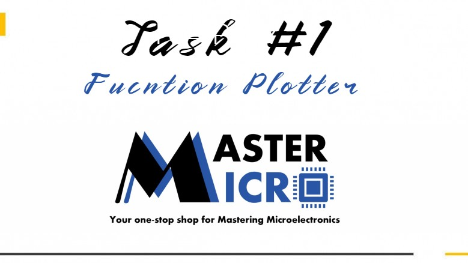

# Function-Plotter

<h3>Build With : </h3>
 <ul>
  <li><a href="https://www.python.org/">Python</a></li>
  <li><a href="https://build-system.fman.io/pyqt5-tutorial">PyQt5</a></li>
  <li><a href="https://docs.pytest.org/en/7.1.x/">pytest</a></li>
  <li><a href="https://matplotlib.org/">matplotlib</a></li>
 </ul>

   
   
<h3>Getting Started</h3>
<blockquote>
  
This is an list of needed instructions to set up your project locally, to get a local copy up and running follow these instructuins.
 

</blockquote>
<h3 href="#Installation">Installation</h3>
<ol>
  <li><strong><em>Clone the repository</em></strong>
    <blockquote>$ git clone https://github.com/MoazHassan2022/Function-Plotter.git</blockquote>
  </li>
  <li> 
  <strong><em>Navigate to repository directory
</em></strong>
    <blockquote>$ cd Function-Plotter</blockquote>
  </li>
  <li> 
  <strong><em>Install dependencies
</em></strong>
    <blockquote>$ python -m pip install -U matplotlib</blockquote>
    <blockquote>$ pip install PyQt5</blockquote>
    <blockquote>$ pip install -U pytest</blockquote>
  </li>
</ol>
<h3 href="#Running">Running</h3>
<ol>
  <li><strong><em>Run the Function Plotter</em></strong>
       <blockquote>$python application.py</blockquote>
  </li>
    <li><strong><em>Running pytest tests </em></strong>
    <blockquote>$cd Testing</blockquote>
    <blockquote>$pytest -v</blockquote>
  </li>
 
</ol>

<h3 href="#EditDesign">Editing Design</h3>
<ol>
  <li><strong><em>Install QT tools</em></strong>
       <blockquote>$pip install pyqt5-tools</blockquote>
  </li>
    <li><strong><em>Start the designer</em></strong>
    <blockquote>$designer</blockquote>
  </li>
 
</ol>

<h2 href="#Structure">Project Structure</h2>
 
 
  <pre>
Function-Plotter
├── Screenshots
├── Images
├── Testing
├── plotter.py
├── main.ui
├── valdiation.py
├── application.py
  </pre>

<h3>Description</h3>
<blockquote>
  

  This application was implemented for a task to get an internship in Master Micro Company.
   
  It is a Function Plotter app with Nice and Responsive GUI that takes 3 inputs: 
  <ol>
  <li>
  <h4>Any 1-Variable Mathematical Function.</h4>
 </li>
 <li>
  <h4>Minimum value of the variable.</h4>
 </li>
 <li>
  <h4>Maximum value of the variable.</h4>
 </li>
 </ol>
 Then it plots this function if it is valid.
 

</blockquote>

<h2 href="#Screenshots">Screenshots</h2>
<ol>
<li>
  <h4>Empty input for function!</h4>
  
 </li>

 <li>
  <h4>Empty input for Minimum and Maximum values</h4>
  
 </li>
 <li>
  <h4>Entered string in Minimum or Maximum value</h4>
  
 </li>
 
 <li> 
 <h4>Invalid syntax in function</h4> 
  
 </li>
 <li> 
 <h4>Minimum value is bigger than Maximum value</h4> 
  
 </li>
 <li> 
 <h4>Using forbidden input in function like import(DANGEROUS!)</h4> 
  
 </li>
 <li> 
 <h4>Valid function 1</h4> 
  
 </li>
 <li> 
 <h4>Valid function 2</h4> 
  
 </li>
</ol>

<h3>Documentation Video</h3>
<blockquote>
  <a href="https://www.youtube.com/watch?v=Nvms-oqXReE">Go to video</a>
</blockquote>

